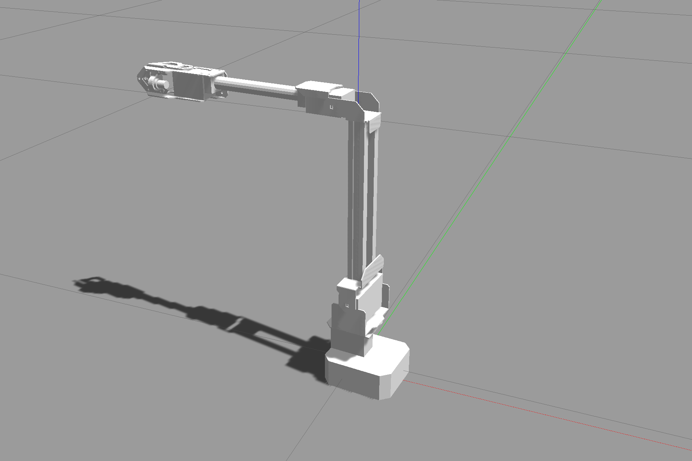
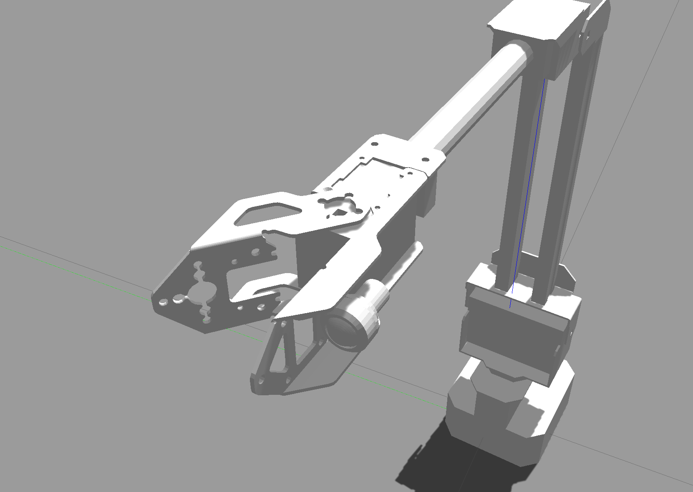

# Gazebo에서 조작하기


##### 예제 코드 (관절)
```
ros2 topic pub -1 /arm_controller/joint_trajectory trajectory_msgs/JointTrajectory "header:
  stamp:
    sec: 0
    nanosec: 0
  frame_id: ''
joint_names:
  - base_link_to_link1
  - link1_to_link2
  - link2_to_link3
points:
  - positions: [0.0, 0.0, 1.57]
    velocities: []
    accelerations: []
    effort: []
    time_from_start:
      sec: 4
      nanosec: 0"

```



##### 예제 코드 (그리퍼 열기)
```
ros2 action send_goal /gripper_action_controller/gripper_cmd control_msgs/action/GripperCommand "{ command: { position: 0.7, max_effort: 50.0 } }"
```

##### 예제 코드 (그리퍼 닫기)
```
ros2 action send_goal /gripper_action_controller/gripper_cmd control_msgs/action/GripperCommand "{ command: { position: 0.0, max_effort: 50.0 } }"
```